% Shodan
% https://github.com/STL2600/shodan-talk

# What is it?

 - Search engine for the "Internet of Things"
 - Searches multiple types of servers, not just web servers
 - Indexes the returned banners from server connection
 - Will take screenshots when it can
 - HTTP/S, FTP, SSH, Telnet, SIP, RTSP, etc.
 
# Origins

 - Created by John Matherly
 - Hobby project while studying bio-inframatics
 - First pitched as "Netcraft for Everything"
 - Originally peer-to-peer shared nmap scans
 - Now scans the top 1000 ports once a week

# Basic Usage

- Browser usage
- Programatically

## Basic Search


## Basic Search

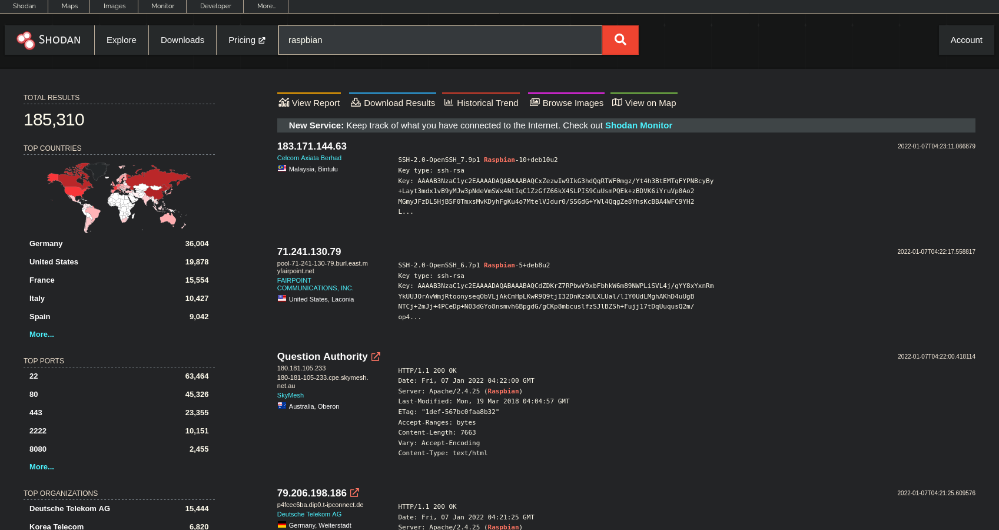

## Basic Search


## Basic Search

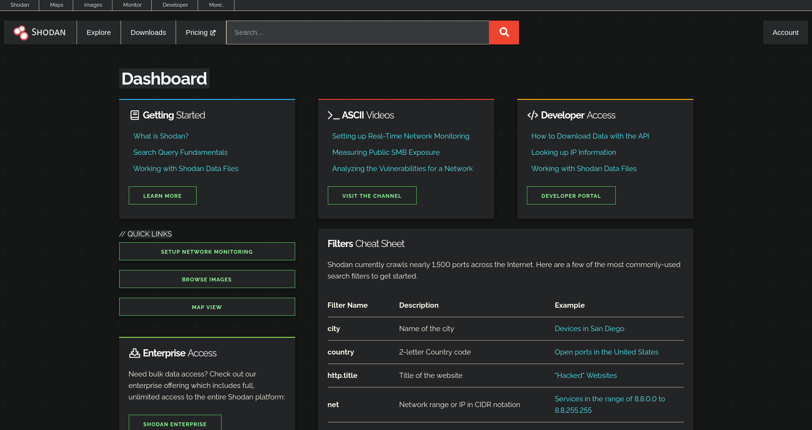

## Getting Ideas

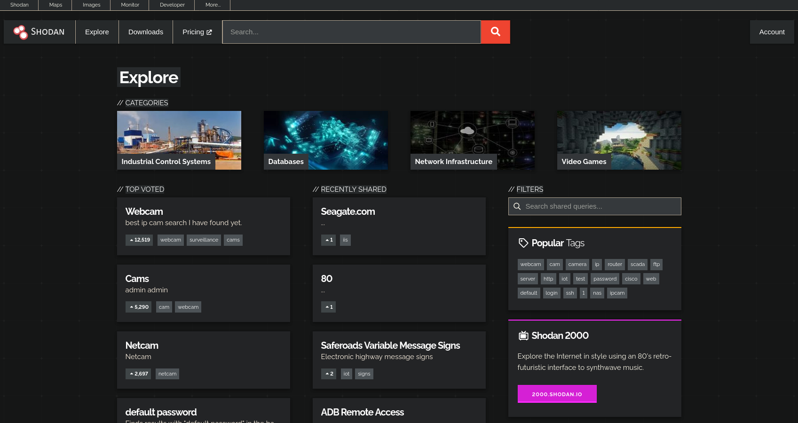

## Monitoring Networks

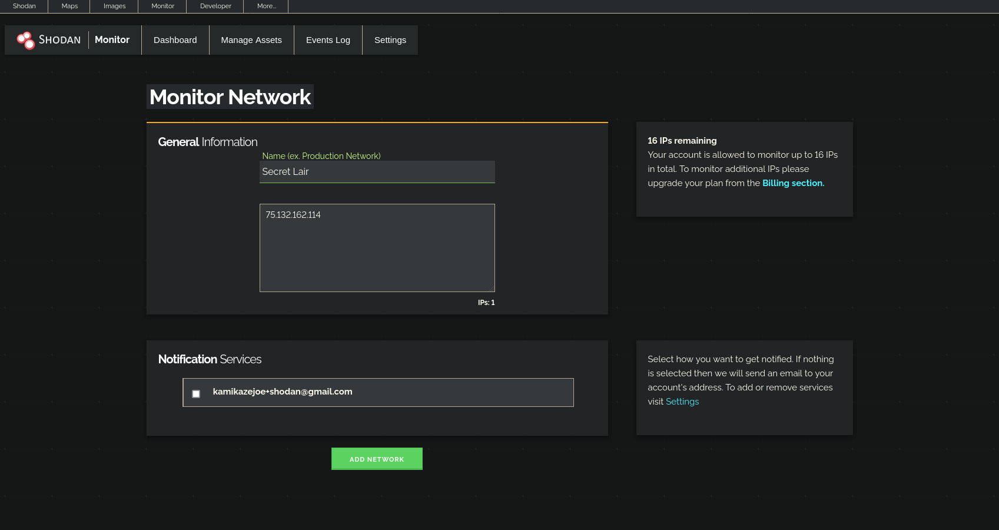

## Monitoring Networks

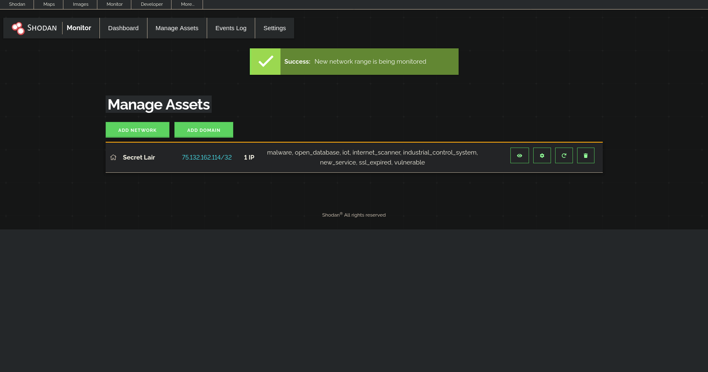

## Monitoring Networks

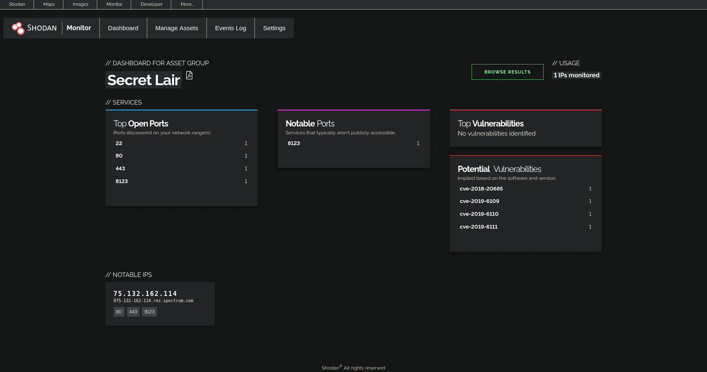

## Shodan Images

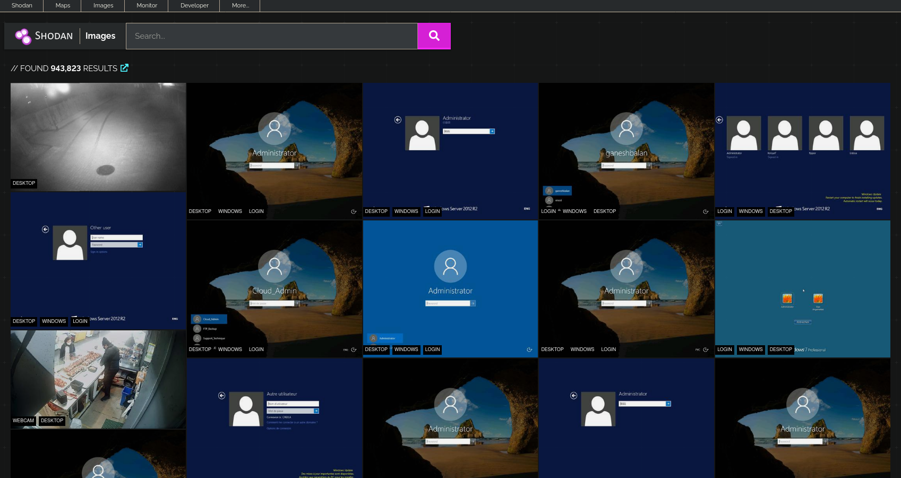

## Shodan Images


## Shodan Images

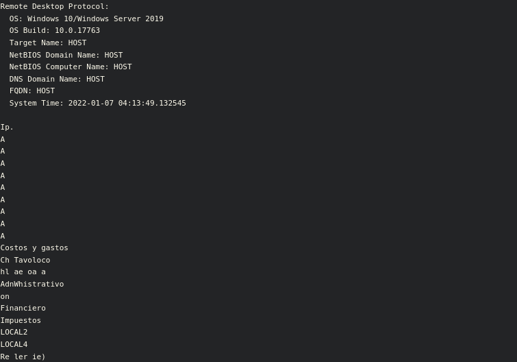

## Shodan Maps

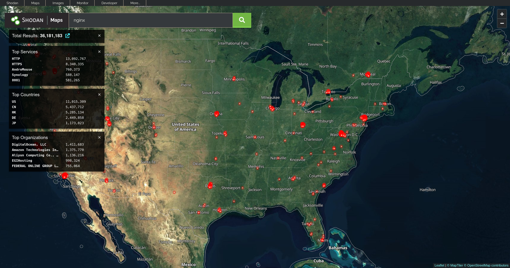

## Shodan Trends

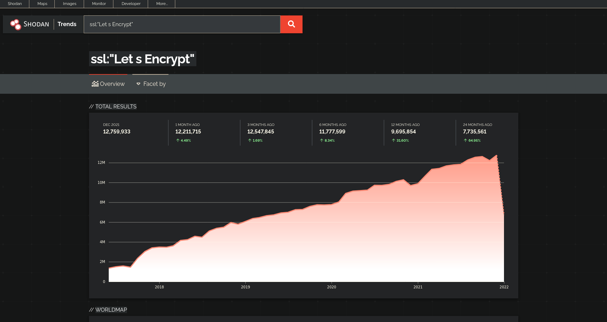

## Shodan Exploits

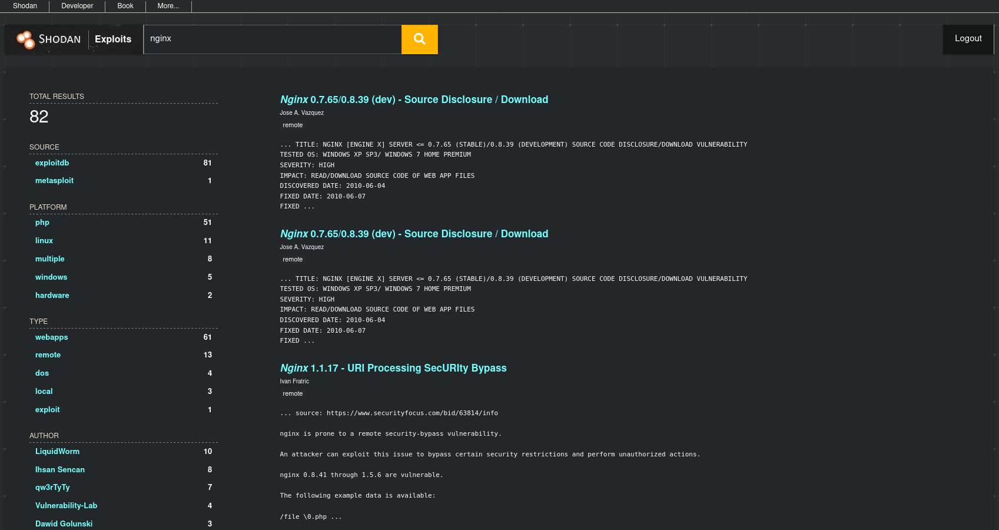

## Internet Exposure Observatory

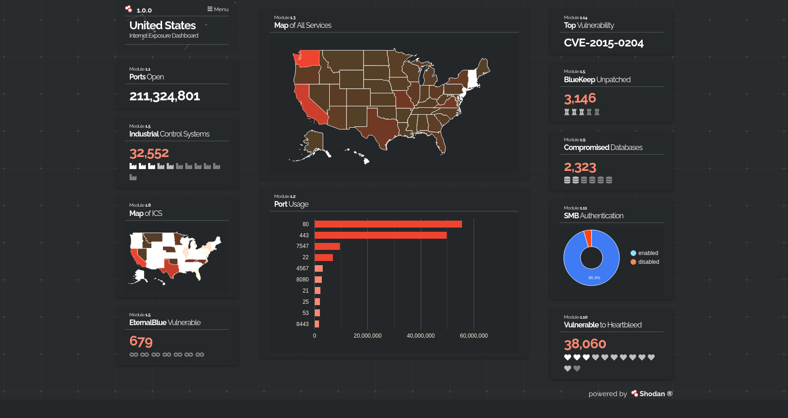

## Honeypot or Not

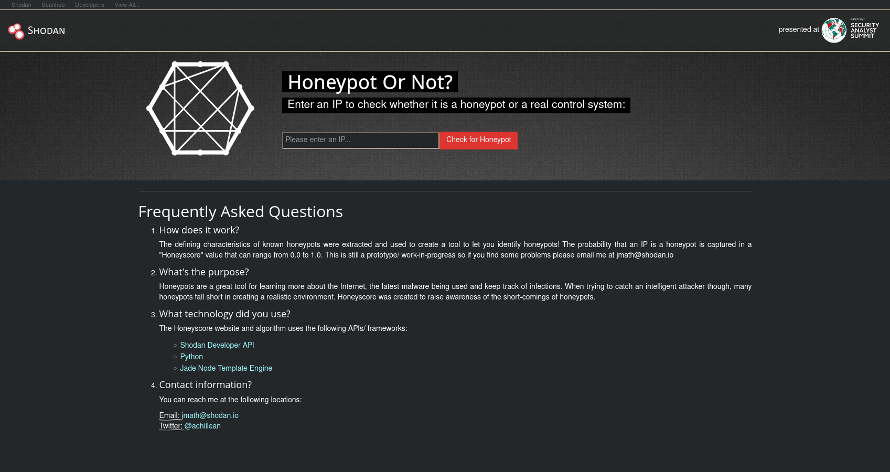

## ICS Rada

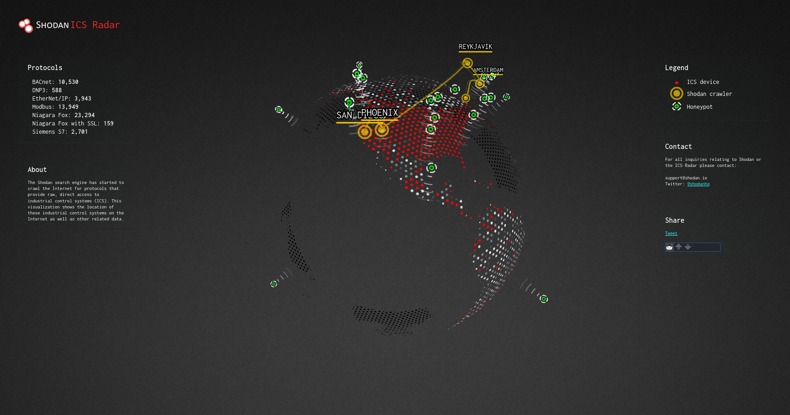

## SHODAN 2000!!!

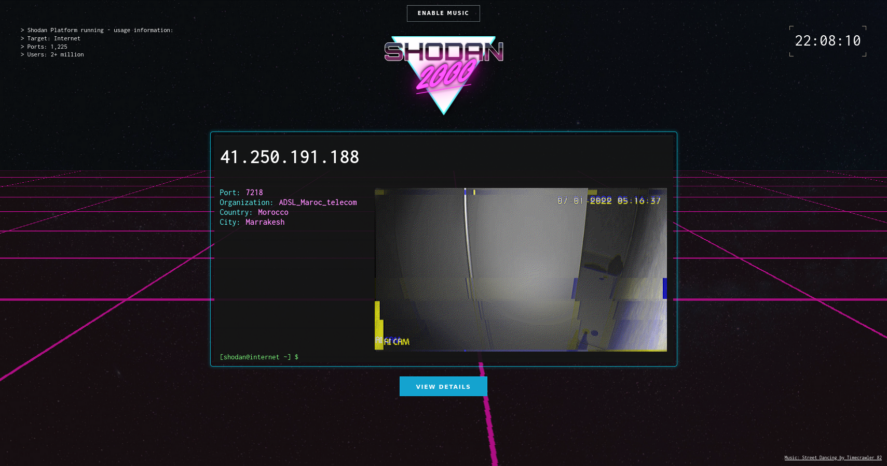

## Browser Plugin

# Programatically - Bob

 - REST API
 - Well documented rest API available for all functionality
 - Third-party client libraries are available for all major languages

# Command line client

# CLI - Init
 - Must be called to set up CLI before any other commands
 - `shodan init <API Key>`

# CLI - Info
 - Shows remaining monthly credits on your account
 - `shodan info`
 
# CLI - Count
 - Perform a search and print the number of matching results
 - `shodan count <Search Term>`
 
# CLI - Search
 - Perform a search and print the results in a TSV format
 - `shodan search <Search Term>`
 
# CLI - Download
 - Perform a search and download the full JSON results to a compressed file 
 - `shodan download <filename> <Search Term>`
 - Use `-l <number>` to limit the number of downloaded results
 
# CLI - Parse
 - Parse a previously downloaded set of search results to extract specific data
 - `shodan parse <filename>`
 
# CLI - Domain
 - Show all known info about a domain name
 - `shodan domain <domain name>`
 - Add a `-S` flag to save the info to a file
 
# CLI - Host 
 - Show all known info about a host
 - `shodan host <IP address>`
 - Add a `-S` flag to save the info to a file

# CLI - General Advice
 - Save search results locally, then process later to save credits
 - Use external tools like `jq` to parse results
 - Import results into spreadsheets for analysis
 - Use limts to preserve your credits
 
# CLI - Demo
 - Goal is to get a port scan of all the "Home Assistant" servers in St. Louis

# CLI - Demo - Count Results

Input
```
shodan count 'city:"Saint Louis" http.title:"Home Assistant"'
```

Output
```
14
```

# CLI - Demo - Download Results

Input
```
shodan download ha-servers  'city:"Saint Louis" http.title:"Home Assistant"’
```

Results will be written to `ha-servers.json.gz`

 
# CLI - Demo - Get Servers

Input
```
shodan parse ha-servers.json.gz --fields ip_str | parallel shodan host -S {}
```

Results will be written to `<ip>.json.gz` for each host

# CLI - Demo - Get Portscan

Input
```
zcat *.json.gz | \
    jq '{ ip: .ip_str, port: .port }' | \
    jq -s | \
    jq 'group_by(.ip) | \
    map({ ip: .[0].ip, ports: (. | map(.port)) })'
```

Output
```
{
  "ip": "174.85.8.154",
  "ports": [
    443,
    8123
  ]
}
{
  "ip": "174.85.8.18",
  "ports": [
    80,
    443,
    8123
  ]
}
...
```

Shodan Showdown
Top 5 Cleverest Queries
Top 3 Weirdest Things Found
Top 3 Most Terrifying Results

