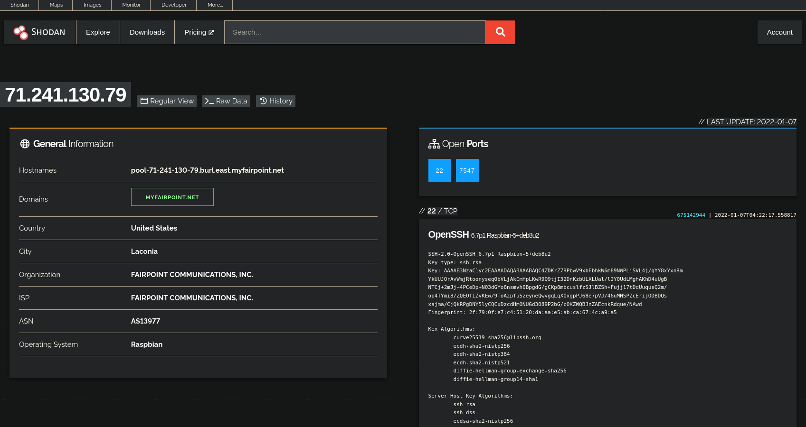
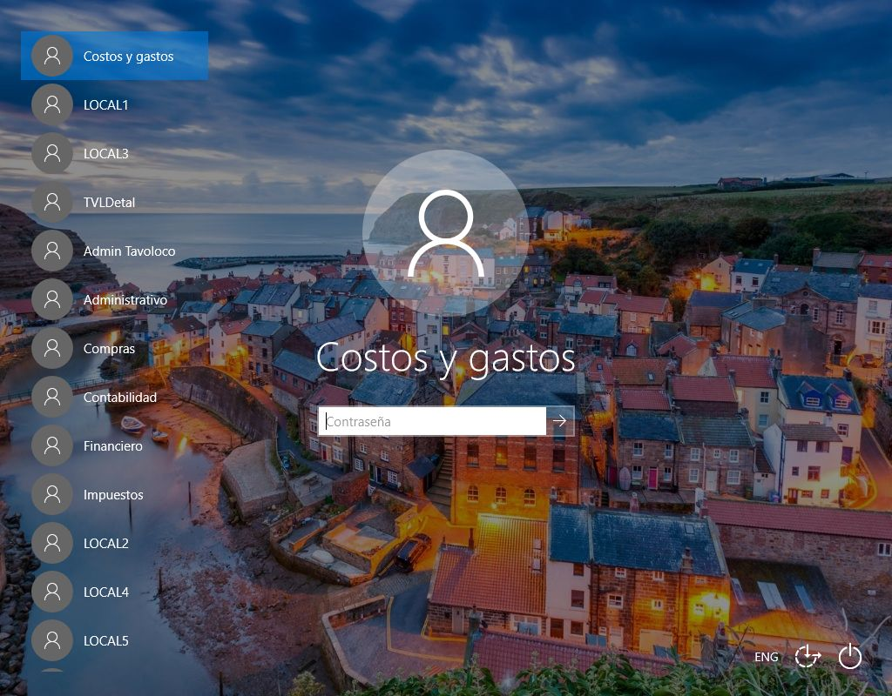

% Shodan
% https://github.com/STL2600/shodan-talk

# What is it?

 - Search engine for the "Internet of Things"
 - Searches multiple types of servers, not just web servers
 - Indexes the returned banners from server connection
 - Will take screenshots when it can
 - HTTP/S, FTP, SSH, Telnet, SIP, RTSP, etc.
 
# Origins

 - Created by John Matherly
 - Hobby project while studying bio-inframatics
 - First pitched as "Netcraft for Everything"
 - Originally peer-to-peer shared nmap scans
 - Now scans the top 1000 ports once a week

# Basic Usage

- Browser usage
- Programatically

## Basic Search


## Basic Search



## Basic Search


## Getting Ideas


## Monitoring Networks


## Monitoring Networks


## Monitoring Networks


## Shodan Images


## Shodan Images



## Shodan Images


## Shodan Maps


## Shodan Trends


## Shodan Exploits


## Internet Exposure Observatory


## Honeypot or Not


## ICS Rada


## SHODAN 2000!!!


# Programatically - Bob

 - REST API
 - Well documented rest API available for all functionality
 - Third-party client libraries are available for all major languages

# Command line client

## CLI - Init
 - Must be called to set up CLI before any other commands
 - `shodan init <API Key>`

## CLI - Info
 - Shows remaining monthly credits on your account
 - `shodan info`
 
## CLI - Count
 - Perform a search and print the number of matching results
 - `shodan count <Search Term>`
 
## CLI - Search
 - Perform a search and print the results in a TSV format
 - `shodan search <Search Term>`
 
## CLI - Download
 - Perform a search and download the full JSON results to a compressed file 
 - `shodan download <filename> <Search Term>`
 - Use `-l <number>` to limit the number of downloaded results
 
## CLI - Parse
 - Parse a previously downloaded set of search results to extract specific data
 - `shodan parse <filename>`
 
## CLI - Domain
 - Show all known info about a domain name
 - `shodan domain <domain name>`
 - Add a `-S` flag to save the info to a file
 
## CLI - Host 
 - Show all known info about a host
 - `shodan host <IP address>`
 - Add a `-S` flag to save the info to a file

## CLI - General Advice
 - Save search results locally, then process later to save credits
 - Use external tools like `jq` to parse results
 - Import results into spreadsheets for analysis
 - Use limts to preserve your credits
 
# CLI - Demo
 - Goal is to get a port scan of all the "Home Assistant" servers in St. Louis

## CLI - Demo - Count Results

Input
```
shodan count 'city:"Saint Louis" http.title:"Home Assistant"'
```

Output
```
14
```

## CLI - Demo - Download Results

Input
```
shodan download ha-servers  'city:"Saint Louis" http.title:"Home Assistant"’
```

Results will be written to `ha-servers.json.gz`

 
## CLI - Demo - Get Servers

Input
```
shodan parse ha-servers.json.gz --fields ip_str | parallel shodan host -S {}
```

Results will be written to `<ip>.json.gz` for each host

## CLI - Demo - Get Portscan

Input
```
zcat *.json.gz | \
    jq '{ ip: .ip_str, port: .port }' | \
    jq -s | \
    jq 'group_by(.ip) | \
    map({ ip: .[0].ip, ports: (. | map(.port)) })'
```

Output
``` {
  "ip": "174.85.8.154",
  "ports": [
    443,
    8123
  ]
}
{
  "ip": "174.85.8.18",
  "ports": [
    80,
    443,
    8123
  ]
}
...
```

# Shodan Showdown

# Top 5 Cleverest Queries

## Robert #1 - Local router admin pages
`state:"MO" city:"Saint Louis" http.title:"router"`

## Joe #1 - Moving to a new town
`city:"Fairview Heights" state:"IL"`

## Robert #2 - Find where certs for a domain name are served
`ssl.cert.subject.cn:secretlair.org`

## Joe #2 - Home Assistant Notifications
```
   - platform: shodan
    api_key: !secret shodan_api
    query: 'net:"75.132.162.114"'
```

## Robert #3 - No authentication VNC
`"authentication disabled" "RFB 003.008"`

## Joe #3 - Rickroll EVERYONE!
```
shodan search "Chromecast:" port:8008 | \
   grep -E -o "([0-9]{1,3}[\.]){3}[0-9]{1,3}" | \
   xargs -I {} \
   vlc rickroll.mp4 --sout "#chromcast" --sout-chromecast-ip={} --dmux-filter=demux_chromecast &

```

## Robert #4 - Only results with screenshots
`has_screenshot:true`

## Joe #4

Ran out of API calls. 
Was gonna look for Playstations and XBoxes


## Robert #5 - Unsecured Elasticsearch Clusters
`product:Elastic "security features are not enabled"`

## Joe #5

Ran out of API calls. 
Was going to search for FLIR cameras

# Top 3 Weirdest Things Found
(Actually it's Top 2 because we both ran out of API calls)

## Robert #1 - Random 3d printer camera feed
`https://www.shodan.io/host/79.160.204.31`

## Joe #1 - Online Gas Pump Near My House
`"in-tank inventory" port:10001 city:"Fairview Heights" state:"IL"`

## Robert #2 - Everything in Antartica
`country:AQ`

## Joe #2 - Hacked Routers
`hostname:"HACKED-ROUTER-HELP-SOS-HAD-DEFAULT-PASSWORD"`

# Top 5 Most Terrifying Results

## License Plate Readers
`P372 "ANPR enabled"`

## Voting systems in the US
`"voter system serial" country:US`

## Telcos running Cisco Lawful Intercept Wiretaps
`"Cisco IOS" "ADVIPSERVICESK9_LI-M"`

## Banks in the US with open Telnet Ports
`bank country:"US" port:"23"`

## Hospital running Home Assistant
`https://www.shodan.io/host/183.88.214.202`
